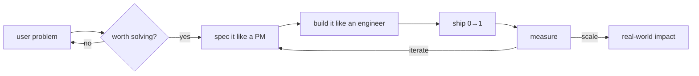
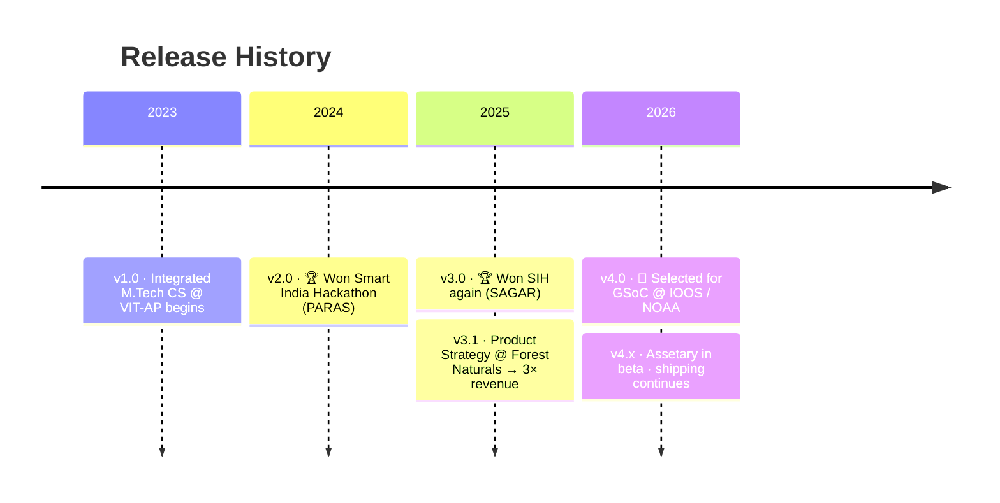

  <a href="https://tanmayrajurkar.netlify.app"><b>portfolio</b></a>
  &nbsp;·&nbsp;
  <a href="https://www.linkedin.com/in/tanmay-rajurkar-254305227/"><b>linkedin</b></a>
  &nbsp;·&nbsp;
  <a href="mailto:tanmayrajurkar1915@gmail.com"><b>email</b></a>

 

## PRD · Product: Tanmay Rajurkar

`doc: LIVE` · `version: 2026.07` · `owner: tanmay` · `reviewers: you`

*Most profiles are resumes. This one is a Product Requirements Document, because the product is me.*

 

 

## `01` · Problem Statement

> Most engineers build things nobody asked for.
> Most PMs spec things they can't build.
> **The gap between "technically works" and "people actually use it" is where products die.**

The market needs builders who can sit in a user interview in the morning and ship the fix by evening.

## `02` · Proposed Solution

One person, dual-core architecture:

<table>
<tr>
<td width="50%" valign="top">

### `core[0]` · The Engineer

- Builds **AI, data & geospatial systems** that survive contact with real users
- Full-stack: FastAPI backends, React frontends, K8s deploys
- Open source: contributing to **NOAA / IOOS** scientific tooling via GSoC 2026
- Bias: *prototype in days, not decks*

</td>
<td width="50%" valign="top">

### `core[1]` · The Product Manager

- Obsessed with **user problems before solutions**
- Writes teardowns ([Nykaa](https://drive.google.com/file/d/1Q_nIqeM14GpFfJ5svqmietqMwjZSYeGO/view), [YouTube](https://www.linkedin.com/posts/tanmay-rajurkar-254305227_youtube-hype-case-study-tanmay-rajurkar-activity-7364757763991793664-obum)) on journeys, metrics & prioritization
- GTM strategy that **3×'d revenue** at Forest Naturals
- Bias: *ship, measure, iterate. In that order*

</td>
</tr>
</table>

**How the two cores talk to each other:**

## `03` · Traction

also on the board: Post-A-Thon (India Post) winner · Google Dev Sprint 1st runner-up · EUREKA @ IIT Bombay

## `04` · Shipped

| Product | What & why it matters | Status |
| :--- | :--- | :--- |
| **SAGAR** 🌊 | **AI-driven marine & geospatial intelligence platform.** Turns ocean data into decisions for GovTech.  🏆 *Winner, Smart India Hackathon 2025* · [demo video](https://drive.google.com/file/d/1IixwOJW0ktL9nHqBxQlKwBZEwWcU40X-/view?usp=drive_link) | `SHIPPED` |
| **PARAS** 🚗 | **Predictive smart parking system** for urban mobility: IoT + ML forecasting where you'll park before you get there.  🏆 *Winner, Smart India Hackathon 2024* · [live demo](https://paras-v1.netlify.app) | `LIVE` |
| **Assetary** 🏗️ | **Real-estate data platform** built on transparent, unbiased data operations.  [beta product](https://reltin.com/) | `BETA` |
| **Teardowns** 📝 | Deep-dive case studies on **[Nykaa](https://drive.google.com/file/d/1Q_nIqeM14GpFfJ5svqmietqMwjZSYeGO/view)** & **[YouTube](https://www.linkedin.com/posts/tanmay-rajurkar-254305227_youtube-hype-case-study-tanmay-rajurkar-activity-7364757763991793664-obum)**: user journeys, metrics, feature prioritization. | `PUBLISHED` |

## `05` · Roadmap · Now Shipping: GSoC 2026 🌊

> ### Enhance NOS Skill Assessment Package's User & Developer Experience
>
> `org: IOOS / NOAA` · `domain: ocean & geospatial` · `status: SELECTED`
>
> Working with **[NOAA / IOOS](https://ioos.us/)** to modernize the open-source **NOS Skill Assessment Package**, the toolkit oceanographers use to validate operational ocean forecast models against real-world observations.
>
> **The mission:** turn a powerful but rough scientific package into something **delightful for users** and **welcoming for new contributors**: better APIs, cleaner workflows, modern tooling, sharper docs, and a DX that scales with the community.
>
> This is the dual-core in action. It's an engineering project scoped like a product problem: the "users" are scientists, the "metric" is contributor onboarding time.
>
> **[Read the project proposal →](https://summerofcode.withgoogle.com/programs/2026/projects/oMVlDkiW)**

## `06` · Changelog

## `07` · Dependencies (Stack)

| | |
| :--- | :--- |
| `languages` | Python · C++ · Java · JavaScript · SQL · Lua |
| `frameworks` | React · Next.js · FastAPI · Node.js |
| `ai / ml` | TensorFlow · PyTorch |
| `infra` | Docker · Kubernetes · Supabase |
| `product` | Figma · Jira · PRDs · teardowns · GTM |

## `08` · Open Questions

*A good PRD always ends with them.*

- Building something in **GovTech, geospatial, or AI-for-the-real-world**? → [tanmayrajurkar1915@gmail.com](mailto:tanmayrajurkar1915@gmail.com)
- Hiring for **product-minded engineering** or **engineering-minded product**? → [LinkedIn](https://www.linkedin.com/in/tanmay-rajurkar-254305227/)
- Just curious? → [Portfolio](https://tanmayrajurkar.netlify.app)

 

*"AI as a means, not an end."*

<b>sign-off:</b> this PRD is approved for production · status: <code>SHIPPING</code> ∎

